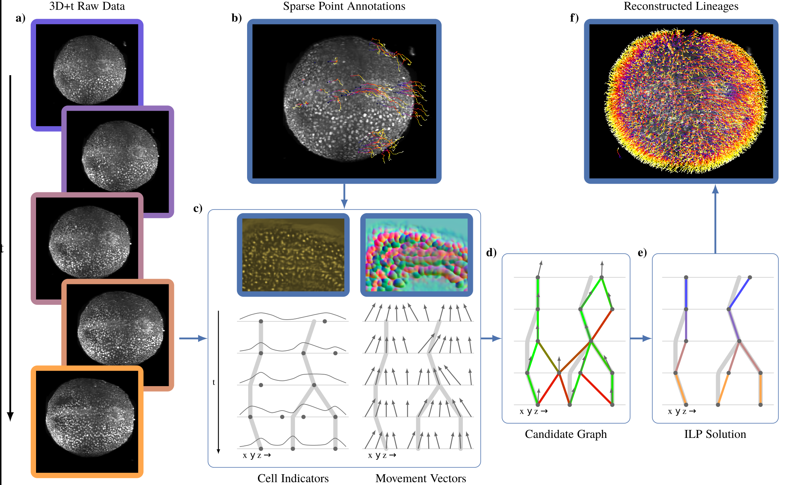

Linajea
=========

Publications
--------------
 - [Automated reconstruction of whole-embryo cell lineages by learning from sparse annotations (nature biotechnology)](https://www.nature.com/articles/s41587-022-01427-7)
 - [Tracking by weakly-supervised learning and graph optimization for whole-embryo C. elegans lineages (arxiv/MICCAI2022)](https://arxiv.org/abs/2208.11467)



This is the main software repository for the linajea cell tracking project.
It includes tools and infrastructure for running a pipeline that starts from 3d+time light sheet data and ends in extracted cell lineage tracks.


Installation
--------------
```
git clone https://github.com/funkelab/linajea.git
cd linajea
conda create --name linajea
conda activate linajea
conda install python
pip install numpy cython
conda install pytorch -c pytorch
pip install -r requirements.txt
pip install -e .
conda install ipykernel # for the example jupyter notebooks
```

The next part is unfortunately currently not as straightforward.
Part of the tracking pipeline is an optimization problem that is formulated as an integer linear program (ILP).
We use `pylp` (https://github.com/funkey/pylp/) as a python wrapper for the `gurobi` and `scip` solvers.
Please check out their respective websites (https://www.gurobi.com/ and https://scipopt.org/) for information on how to install them.
You need to have at least one of them installed (if both are installed `gurobi` is preferred).\
Then, to install `pylp`:

```
git clone git@github.com:funkey/pylp.git
cd pylp
```
If you only have `scip`:
 - please remove the line `#define HAVE_GUROBI` in `pylp/impl/config.h`
 - change the line `libraries=['gurobi80', 'scipopt']` to `libraries=['scipopt']` in `setup.py`

If you only have `gurobi`:
 - please remove the line `#define HAVE_SCIP` in `pylp/impl/config.h`
 - change the line `libraries=['gurobi80', 'scipopt']` to `libraries=['gurobiXX]` (set `XX` depending on your `gurobi` version, for instance `gurobi91` for `gurobi 9.1.2` in `setup.py`

If your `gurobi` or `scip` installation is not in the global search path:
 - add a line `library_dirs=['/path/to/folder/containing/lib']` below `libraries=...`, e.g. `library_dirs=['gurobi-9.1.2/lib']` (`gurobi` library: `libgurobiXX.so`, `scip` library: `libscipopt.so`)
 - add the path to the header files to `include_dirs`, e.g. `include_dirs=['pylp/impl', 'gurobi-9.1.2/include']`

Next:
```
cd pylp/impl
git clone https://github.com/funkey/solvers.git
cd solvers
git rebase -Xtheirs origin/min_deps
curl https://raw.githubusercontent.com/funkelab/linajea/master/pylp.patch | git apply
cd ../../../
pip install -e .
```


Versioning
------------
The main branch contains the current version of the code. New features and bugfixes will be developed in separate branches before being merged into main.
The experiments in the Nature Biotechnology paper have been conducted with v1.3, the experiments in the MICCAI paper with v1.4 (see tags). For the public release we refactored major parts of the code, breaking backwards compatibility.
A separate repository (https://github.com/linajea/linajea_experiments) contains all the scripts necessary to replicate the paper results, using the appropriate release.


Use
---
Have a look at the jupyter notebook [examples](examples) or look at the [run scripts](run_scripts) directly.


Contributing
--------------
If you make any improvements to the software, please fork, create a new branch named descriptively for the feature you are upgrading or bug you are fixing, commit your changes to that branch, and create a pull request asking for permission to merge.
Help is always appreciated!


Other
------
If you have any questions and can't find the answers you need in the examples or in the code documentation, feel free to contact us!
